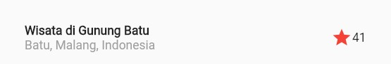

## Praktikum 1 : Membangun Layout di Flutter

### Langkah 2 : Buka file lib/main.dart

**code:**

```dart
import 'package:flutter/material.dart';

void main() => runApp(const MyApp());

class MyApp extends StatelessWidget {
  const MyApp({super.key});

  @override
  Widget build(BuildContext context) {
    return MaterialApp(
      title: 'Flutter layout: Ahmad Fathan Aqil Faiq, 2141720172',
      home: Scaffold(
        appBar: AppBar(
          title: const Text('Flutter layout demo'),
        ),
        body: const Center(
          child: Text('Hello World'),
        ),
      ),
    );
  }
}
```

### Langkah 4 : Implementasi title row

**full code:**

```dart
  Widget titleSection = Container(
    padding: const EdgeInsets.all(32),
    child: Row(
      children: [
        Expanded(
          // Soal 1
          child: Column(
            crossAxisAlignment: CrossAxisAlignment.start,
            children: [
              // soal 2
              Container(
                padding: const EdgeInsets.only(bottom: 1.0),
                child: const Text(
                  'Wisata di Gunung Batu',
                  style: TextStyle(
                    fontWeight: FontWeight.bold,
                  ),
                ),
              ),
              const Text(
                'Batu, Malang, Indonesia',
                style: TextStyle(color: Colors.grey),
              )
            ],
          ),
        ),
        //soal 3
        const Icon(
          Icons.star,
          color: Colors.red,
        ),
        const Text("41"),
      ],
    ),
  );

```

**memanggil:**

```dart
 Widget build(BuildContext context) {
    return MaterialApp(
      title: 'Flutter Layout: Ahmad Fathan Aqil Faiq, 2141720172',
      home: Scaffold(
          appBar: AppBar(
            title: const Text('Flutter Layout Demo'),
          ),
          body: Column(
            children: [
              titleSection,
            ],
          )),
    );
  }
```

**Hasil**



## Praktikum 2: Implementasi button row

### Langkah 1: Buat method Column \_buildButtonColumn

**code**

```dart
Column _buildButtonColumn(Color color, IconData icon, String label) {
    return Column(
      mainAxisSize: MainAxisSize.min,
      mainAxisAlignment: MainAxisAlignment.center,
      children: [
        Icon(icon, color: color),
        Container(
          margin: const EdgeInsets.only(top: 8),
          child: Text(
            label,
            style: TextStyle(
              fontSize: 12,
              fontWeight: FontWeight.w800,
              color: color,
            ),
          ),
        )
      ],
    );
  }
```

### Langkah 2: Buat widget buttonSection

**Code:**

```dart
Color color = Theme.of(context).primaryColor;

    Widget buttonSection = Row(
      mainAxisAlignment: MainAxisAlignment.spaceEvenly,
      children: [
        _buildButtonColumn(color, Icons.call, 'CALL'),
        _buildButtonColumn(color, Icons.near_me, 'ROUTE'),
        _buildButtonColumn(color, Icons.share, 'SHARE'),
      ],
    );

```

### Langkah 3: Tambah button section ke body

```dart

    return MaterialApp(
      title: 'Flutter Layout: Ahmad Fathan Aqil Faiq, 2141720172',
      home: Scaffold(
          appBar: AppBar(
            title: const Text('Flutter Layout Demo'),
          ),
          body: Column(
            children: [
              titleSection,
              buttonSection,
            ],
          )),
    );
```

**Hasil**


## Praktikum 3: Implementasi text section

### Langkah 1: Buat widget textSection

```dart
Widget textSection = Container(
   padding: const EdgeInsets.all(32),
    child: const Text(
      """ Kampung Wisata Jodipan adalah kampung wisata pertama di Kota Malang berupa sederetan rumah warga di tepi Sungai Brantas yang menampilkan dinding dengan aneka warna yang menarik dan tidak monoton. Kampung ini terletak di Jodipan berada di tepi Sungai Brantas. Kampung Wisata Jodipan ini biasanya dijuluki Kampung Warna Warni.
      

      """
      'Ahmad Fathan Aqil Faiq, 2141720172 '
      'Minggu 7 ',
      softWrap: true,
    ),
);
```

### Langkah 2: Tambahkan variabel text section ke body

**code**

```dart
return MaterialApp(
      title: 'Flutter Layout: Ahmad Fathan Aqil Faiq, 2141720172',
      home: Scaffold(
          appBar: AppBar(
            title: const Text('Flutter Layout Demo'),
          ),
          body: SingleChildScrollView(
            child: Column(
              children: [
                Image.network('assets/images/kwj.jpg'),
                titleSection,
                buttonSection,
                textSection,
              ],
            ),
          )),
    );
```

**Jawaban**


## Praktikum 4: Implementasi image section

### Langkah 1: Siapkan aset gambar

```yaml
flutter:
  uses-material-design: true

  assets:
    - assets/images/
```

### Langkah 2: Tambahkan gambar ke body

```dart
return MaterialApp(
      title: 'Flutter Layout: Ahmad Fathan Aqil Faiq, 2141720172',
      home: Scaffold(
        appBar: AppBar(
          title: const Text('Flutter Layout Demo'),
        ),
        body: SingleChildScrollView(
          child: Column(
            children: [
              Image.network(
                'assets/images/kwj.jpg',
                width: 600,
                height: 400,
                fit: BoxFit.cover,
              ),
              titleSection,
              buttonSection,
              textSection,
            ],
          ),
        ),
      ),
    );

```

### Langkah 3: Terakhir, ubah menjadi ListView

```dart
return MaterialApp(
      title: 'Flutter Layout: Ahmad Fathan Aqil Faiq, 2141720172',
      home: Scaffold(
        appBar: AppBar(
          title: const Text('Flutter Layout Demo'),
        ),
        body: ListView(
          children: [
            Image.network(
              'assets/images/kwj.jpg',
              width: 600,
              height: 400,
              fit: BoxFit.cover,
            ),
            titleSection,
            buttonSection,
            textSection,
          ],
        ),
      ),
    );
```

**Hasil**

